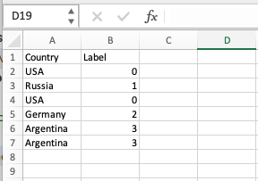

# CATCODE - Simple Coding Function in Excel
_____
The CATCODE function is a custom function developed in Visual Basic for Excel that allows you to assign simple codes to the values in a column in a spreadsheet. These codes are assigned based on the order in which the values appear for the first time.
Functionality

The CATCODE function takes a range of cells containing the values from the desired column as input. It then assigns a code to each cell based on its value, using the following logic:

If a value appears for the first time, it is assigned a code of 0.
If a value has appeared before, it is assigned the next available code in ascending order.

The result of the function is an array containing the codes corresponding to the values in the original column.

## How to Use the CATCODE Function
________

 + Open Microsoft Excel and navigate to the workbook where you want to use the CATCODE function.

 + Press "Alt + F11" on your keyboard. This keyboard shortcut opens the Visual Basic for Applications (VBA) editor in Excel.

+ In the VBA editor, you'll see a window with the Project Explorer on the left side. If the Project Explorer is not visible, go to "View" > "Project Explorer" or press "Ctrl + R" to show it.

+ Right-click on the workbook name in the Project Explorer and select "Insert" > "Module" from the context menu. This will insert a new module into the workbook.

+ Double-click on the newly created module to open the code window for that module.

+ In this code window, you'll see a blank area where you can enter your VBA code. 

+ Copy  the code (in the catcode.bv file)

+ Close the VBA editor by clicking the "X" button in the top-right corner of the editor window or by pressing "Alt + Q" on your keyboard.

You have successfully copied and pasted the CATCODE function code into your Excel workbook. You can now use the CATCODE function in your spreadsheet.
## Example
___________________

v

## Requirements
________

    Microsoft Excel (compatible with recent versions).
    Enable macros in Excel to allow the execution of custom functions.
    
 
